# Microsoft Defender Threat Hunting & Detection

A hands-on Microsoft Defender for Endpoint project covering endpoint telemetry analysis, threat hunting with KQL, custom detection development, and incident documentation.

The central finding: a six-step activity chain mapping to seven MITRE ATT&CK techniques was executed on a monitored endpoint and **generated no alerts**, despite Defender tagging the individual events with ATT&CK techniques in the device timeline. The activity was found by hunting, not by alerting.

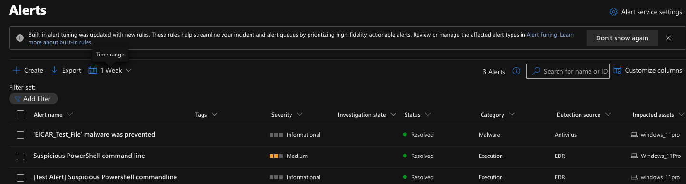

*The alert queue after the full chain ran. Three alerts, all from earlier controlled detection tests, all resolved. Nothing from the activity described below.*

---

## What this covers

| Area | Work performed |
|---|---|
| Endpoint onboarding | Windows 11 Pro VM onboarded via local script; sensor and antivirus state verified |
| Alert triage | Three controlled detections triaged, classified and resolved through the incident queue |
| Threat hunting | Six KQL queries across four telemetry tables |
| Correlation | Multi-table `union` query reconstructing a full activity timeline |
| Detection engineering | Scheduled custom detection rule built from validated hunting logic |
| Documentation | Full incident report with ATT&CK mapping and stated limitations |

---

## Repository contents

```
hunting/        Six KQL queries, commented, as actually run
detections/     The custom detection rule with design rationale
report/         INC-001 incident report
evidence/       Screenshots from the Defender portal
exports/        Query results as CSV, catalogued in exports/README.md
```

Every screenshot is catalogued in [`evidence/README.md`](evidence/README.md). They are numbered by the stage of work they document: `00` environment and first detections, `01` incident triage and classification, `02` device timeline, `03` single-table hunting queries, `04` multi-table correlation, `05` detection rule development and its first triggered alert.

---

## The investigation

**Activity chain executed on the lab host:**

```
systeminfo          →  net localgroup administrators  →  file staging
                    →  Compress-Archive               →  outbound HTTPS
                    →  Remove-Item -Recurse -Force
```

**Techniques observed:** T1059.001, T1082, T1069.001, T1087.001, T1074.001, T1560.001, T1071.001, T1070.004

**Alerts generated:** none

Every command is a built-in Windows or PowerShell utility, executed by an interactive user, one at a time, against a reputable destination. No single step crosses a detection threshold. This is the shape of living-off-the-land activity, and it is the reason threat hunting exists as a discipline separate from alert triage.

Defender recorded the activity and tagged it with ATT&CK techniques in the device timeline without raising an alert:

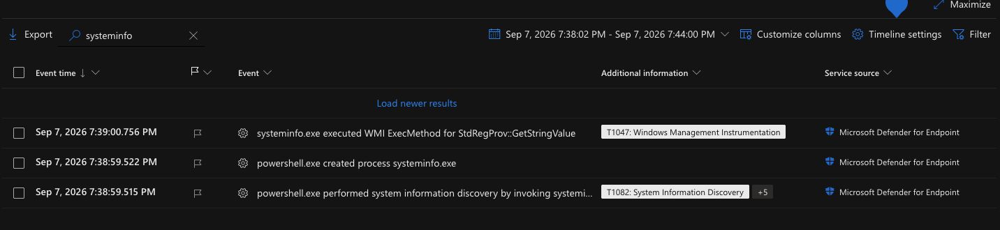

*`systeminfo.exe` spawned by PowerShell, tagged T1082 System Information Discovery plus five further techniques.*

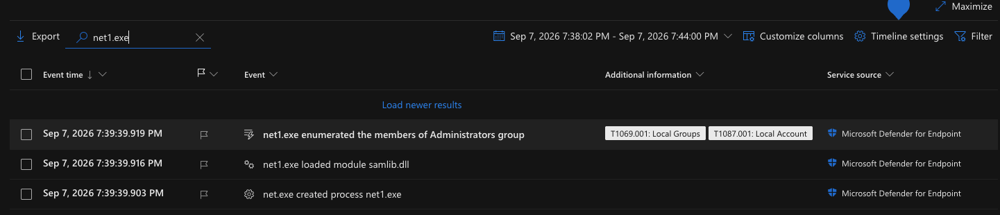

*`net.exe` handing off to `net1.exe`, which enumerated the Administrators group. Tagged T1069.001 and T1087.001.*

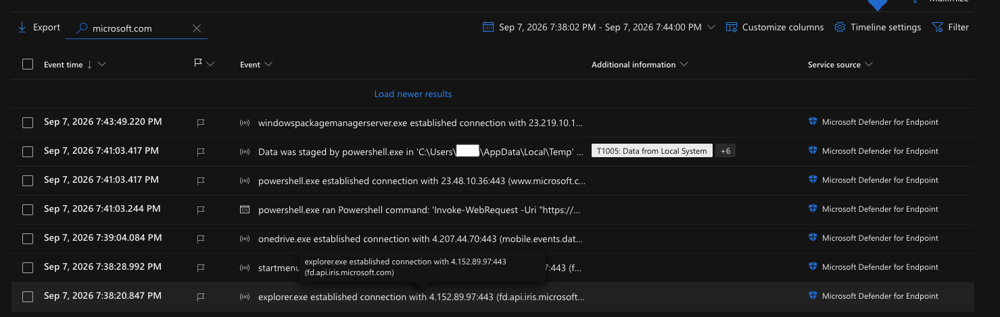

*Data staging tagged T1005 plus six further techniques, alongside the outbound connection initiated by PowerShell.*

Correlating four telemetry tables into one query produced the full sequence in a single view:

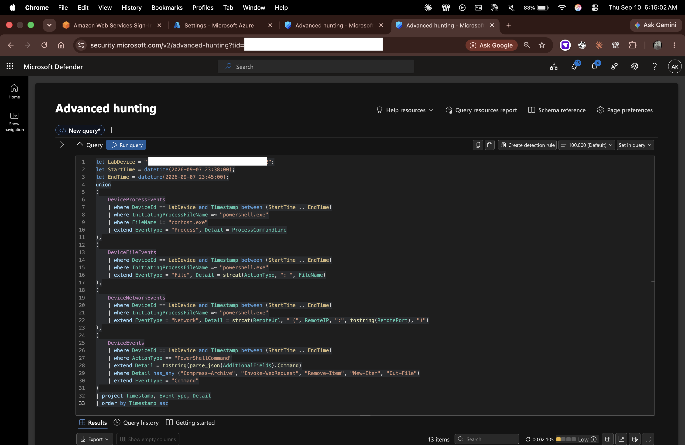

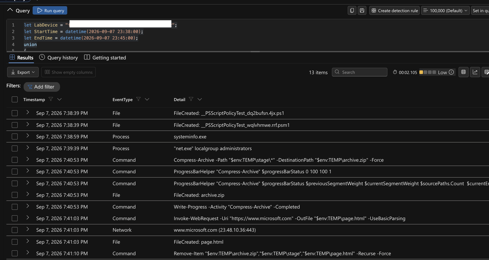

Raw data: [`exports/correlation-timeline.csv`](exports/correlation-timeline.csv)

*Process, file, network and command telemetry in one chronological view — the complete chain from discovery through cleanup. The screenshot shows thirteen rows; the exported CSV in `exports/` shows ten, after the filter was tightened from a term match to an anchored regex to drop PowerShell's internal progress-bar calls.*

---

## Findings

**1. Technique-tagged telemetry below alert threshold.** Defender recorded the activity and labelled events with ATT&CK techniques directly in the device timeline — T1082, T1069.001 with T1087.001, T1005 — without raising an alert for any of them. The platform classified the behaviour and still did not consider it alert-worthy.

**2. Selective file telemetry.** `archive.zip` and `page.html` were recorded in `DeviceFileEvents`. Three small text files created in a user temp directory moments earlier were not, confirmed by direct query. An attacker staging data in small plaintext files would leave no file-creation evidence under this sensor configuration. The precise mechanism was not determined and is reported as an observed gap.

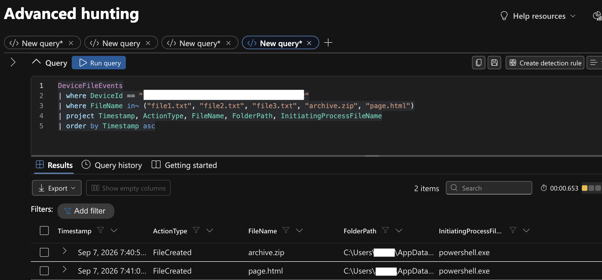

*Queried explicitly for all five filenames. Only `archive.zip` and `page.html` returned.*

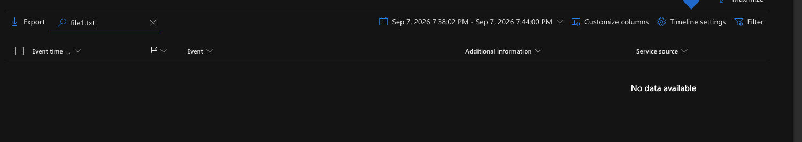

*The same absence confirmed independently through the device timeline.*

**3. Process handoff in `net.exe`.** `net.exe localgroup` spawns `net1.exe`, which performs the enumeration. Detection logic filtering only on the parent risks missing the child; both are included in the detection rule.

**4. Duplicate correlation results.** Two discovery commands pairing with one archive event produced two alerts for a single incident. Deduplication with `summarize arg_min()` reduced this to one.

---

## Detection rule

Alerts when a single device shows PowerShell-initiated discovery, followed within ten minutes by archive creation, followed within a further ten minutes by an outbound connection.

Key design decisions:

- **Combinations, not indicators.** Alerting on `Compress-Archive` alone would fire on every backup script in an environment.
- **Time bounding.** Without the ten-minute windows, an inner join on `DeviceId` would pair a discovery command from one day with an archive from another.
- **No automated response.** Remediation actions were left unconfigured. The rule's false-positive rate is unmeasured, and automated isolation on an untuned detection causes more operational disruption than the threat it addresses.

**Validated end to end.** The rule was deployed enabled and ran on its own schedule, generating a Medium-severity alert with the correct category and entity mapping. The path exercised: hunting query, scheduled execution, alert generation, queue delivery.

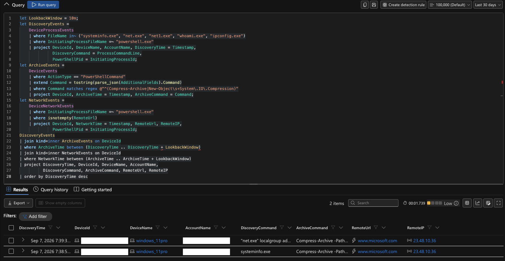

*The detection query: two inner joins chaining discovery to archive to network, each bounded by a ten-minute window.*

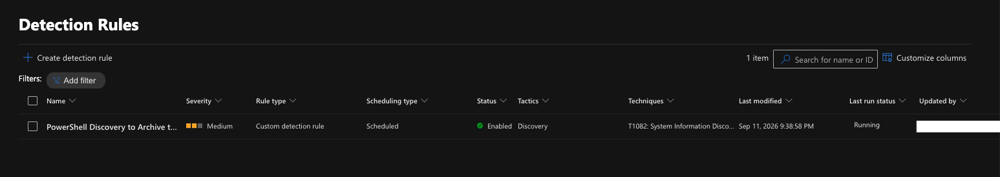

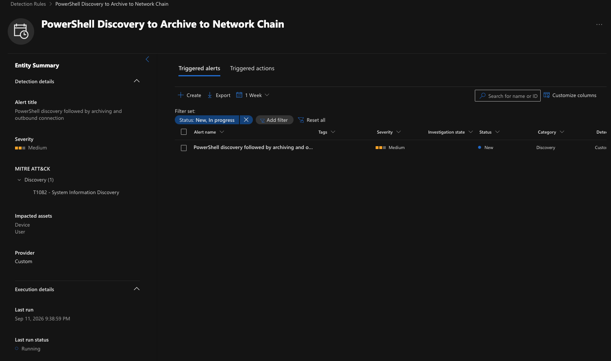

*The rule after its scheduled run — one triggered alert, Medium severity, Discovery category, device and user entities mapped.*

Rule output: [`exports/detection-rule-match.csv`](exports/detection-rule-match.csv)

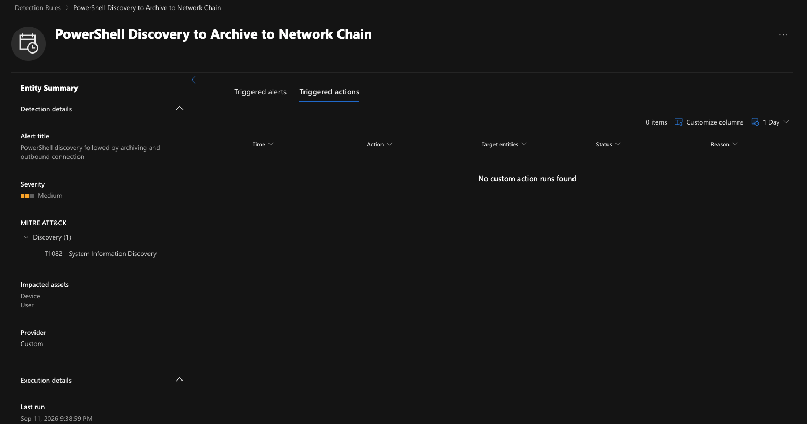

*Remediation actions deliberately left unconfigured.*

---

## Environment

Microsoft Defender for Endpoint Plan 2 · Windows 11 Pro 25H2 · single standalone workstation, workgroup (not domain-joined)

---

## Limitations

This was a controlled lab, and the following constraints apply to any conclusion drawn from it.

- One endpoint. No fleet, no baseline of normal organisational behaviour.
- Standalone host — no identity telemetry, no cross-device correlation.
- Activity was generated deliberately using benign built-in tooling against a reputable destination. No malicious code, no real adversary tradecraft, no data exfiltrated.
- The detection rule has not been validated against production traffic and its false-positive rate is unknown.
- Defender for Endpoint only. No Sentinel, Defender for Identity, Office or Cloud Apps, so multi-product incident correlation was not assessed.

This work demonstrates investigation methodology, hunting technique and detection development in a lab context. It does not constitute production security operations experience.

---

Tenant identifiers, device IDs, account names and internal IP addresses have been redacted throughout.
