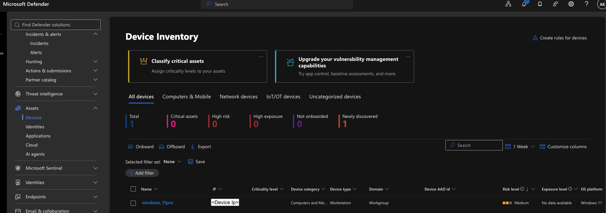

# INC-001 — PowerShell Discovery, Staging and Egress Chain

**Analyst:** Akshaykumar Kathirvelu
**Date of activity:** 2026-09-07
**Date of report:** 2026-09-11
**Environment:** Controlled lab, Microsoft Defender for Endpoint Plan 2
**Classification:** Benign positive — authorised testing

---

## 1. Summary

On 2026-09-07 between 23:38 and 23:41 UTC, proactive threat hunting identified a sequence of PowerShell activity on host `windows_11pro` consisting of system and account discovery, local file staging, archive creation, an outbound HTTPS connection, and deletion of all created artefacts. Microsoft Defender for Endpoint generated no alert at any stage; the activity was found by querying endpoint telemetry directly. On behavioural grounds the sequence is consistent with collection and staging prior to exfiltration and was assessed as suspicious. Verification confirmed it was authorised lab testing performed by the interactive user `LAB-USER`, and it is classified as benign.

---

## 2. Timeline

All times UTC. Local time was EDT (UTC-4).

| Time (UTC) | Event | Evidence source |
|---|---|---|
| 23:38:39 | `__PSScriptPolicyTest_*.ps1` and `.psm1` created — PowerShell execution policy check | `DeviceFileEvents` |
| 23:38:59 | `powershell.exe` created process `systeminfo.exe` | `DeviceProcessEvents` |
| 23:39:39 | `net.exe localgroup administrators` executed | `DeviceProcessEvents` |
| 23:39:39 | `net.exe` created process `net1.exe`, which enumerated the Administrators group | `DeviceProcessEvents` |
| 23:40:53 | `Compress-Archive -Path "$env:TEMP\stage\*" -DestinationPath "$env:TEMP\archive.zip" -Force` | `DeviceEvents` (`PowerShellCommand`) |
| 23:40:53 | `archive.zip` created in `C:\Users\LAB-USER\AppData\Local\Temp` | `DeviceFileEvents` |
| 23:41:03 | `Invoke-WebRequest -Uri "https://www.microsoft.com" -OutFile "$env:TEMP\page.html" -UseBasicParsing` | `DeviceEvents` (`PowerShellCommand`) |
| 23:41:03 | Outbound connection to `www.microsoft.com` (23.48.10.36:443) initiated by `powershell.exe` | `DeviceNetworkEvents` |
| 23:41:03 | `page.html` created in the same temp folder | `DeviceFileEvents` |
| 23:41:10 | `Remove-Item "$env:TEMP\archive.zip","$env:TEMP\stage","$env:TEMP\page.html" -Recurse -Force` | `DeviceEvents` (`PowerShellCommand`) |

**Note on the 23:40:53 pair.** The `Compress-Archive` command and the `archive.zip` file creation are the same action observed from two independent tables approximately 300 milliseconds apart. Both rows are retained rather than merged: corroboration across separate telemetry sources is what makes the entry evidence rather than an assertion.

**Note on a missing step.** The staging directory and the three text files written into it (`file1.txt`, `file2.txt`, `file3.txt`) do not appear in any table. See Finding 2.

**Evidence:** `../evidence/screenshots/04-correlation-results.png` — the full correlated timeline across all four tables. Raw export: `../exports/correlation-timeline.csv`

---

## 3. Affected assets

| Attribute | Value |
|---|---|
| Hostname | `windows_11pro` |
| DeviceId | `<DEVICE-ID>` |
| Operating system | Windows 11 Pro, version 25H2, build 26200.8457 |
| Device type | Workstation |
| Domain | Workgroup (not domain-joined) |
| IP address | <INTERNAL-IP> |
| Account | `LAB-USER` |
| Session type | Interactive |
| Risk level at time of investigation | Medium |
| Criticality level | Not set |

**Session context.** The process ancestry was `userinit.exe → explorer.exe → cmd.exe → powershell.exe`. This chain indicates a logged-on user working at a desktop session rather than a service, scheduled task, or remotely injected process.

**Risk level attribution.** The Medium risk level was driven by three unresolved alerts from earlier controlled detection tests on the same host, not by the activity described in this report. No alert was raised for this activity at any point.

Device identity was confirmed as a single DeviceId despite two spellings appearing in the portal: `../evidence/screenshots/01-deviceid-count.png`

**Scoping consequence of workgroup membership.** The host is standalone and not joined to Active Directory or Entra ID. Two consequences follow. First, no identity telemetry exists for correlation — `IdentityLogonEvents` and cloud sign-in data are unavailable for this device. Second, lateral movement using domain credentials is out of scope, which would not be true in an enterprise environment.

---

## 4. Investigation method

The activity was not surfaced by any alert. It was found by hunting, using the following approach.

**Step 1 — Device timeline review.** The device timeline was searched term by term across a six-minute window. Five of the six actions were located. This method proved slow and difficult to read: the timeline is an unfiltered chronological stream containing all sensor observations, with no indication of which events are related.

**Step 2 — Targeted single-table queries.** Four Advanced Hunting queries were run against the tables relevant to each question:

| Question | Table |
|---|---|
| What executed? | `DeviceProcessEvents` |
| What was written to disk? | `DeviceFileEvents` |
| What network connections were made? | `DeviceNetworkEvents` |
| What was PowerShell instructed to do? | `DeviceEvents` where `ActionType == "PowerShellCommand"` |

**Step 3 — Correlation.** A single `union` query combined all four tables into one chronological view, normalising their differing column names into common `EventType` and `Detail` fields. This produced the timeline in Section 2 and reduced investigation time from repeated manual searching to a single query.

**Evidence for each step:**

| Query | Screenshot |
|---|---|
| Process discovery | `../evidence/screenshots/03-kql-process-discovery.png` |
| File events | `../evidence/screenshots/03-kql-file-events.png` |
| PowerShell commands | `../evidence/screenshots/03-kql-powershell-commands.png` |
| Correlation query | `../evidence/screenshots/04-kql-correlation.png` |
| Device timeline searches | `../evidence/screenshots/02-timeline-discovery-systeminfo.png`, `02-timeline-discovery-netlocalgroup.png`, `02-timeline-file-events.png`, `02-timeline-network.png` |

All queries were scoped by `DeviceId` rather than `DeviceName`. The device appeared in the portal under two spellings (`Windows_11Pro` and `windows_11pro`); a `summarize count() by DeviceName, DeviceId` query confirmed a single DeviceId, establishing that the casing difference was cosmetic. Filtering on device name would have risked missing events.

---

## 5. MITRE ATT&CK mapping

| Technique | Name | Supporting evidence |
|---|---|---|
| T1059.001 | Command and Scripting Interpreter: PowerShell | All activity executed via `powershell.exe` under an interactive user session |
| T1082 | System Information Discovery | `systeminfo.exe` spawned by `powershell.exe` at 23:38:59 |
| T1069.001 | Permission Groups Discovery: Local Groups | `net.exe localgroup administrators` at 23:39:39; `net1.exe` enumerated the Administrators group |
| T1087.001 | Account Discovery: Local Account | Same event — Defender tagged this event with both T1069.001 and T1087.001 |
| T1074.001 | Data Staged: Local Data Staging | Defender device timeline recorded "Data was staged by powershell.exe in C:\Users\LAB-USER\AppData\Local\Temp", tagged T1005 and six further techniques |
| T1560.001 | Archive Collected Data: Archive via Utility | `Compress-Archive` at 23:40:53 producing `archive.zip` |
| T1071.001 | Application Layer Protocol: Web Protocols | Outbound HTTPS to 23.48.10.36:443 initiated by `powershell.exe` at 23:41:03 |
| T1070.004 | Indicator Removal: File Deletion | `Remove-Item -Recurse -Force` at 23:41:10 removing the archive, staging directory and downloaded file |

---

## 6. Findings

**Finding 1 — Technique-tagged telemetry below alert threshold.**
Defender for Endpoint observed the activity and labelled individual events with ATT&CK techniques directly in the device timeline, including T1082 with five additional techniques, T1069.001 with T1087.001, and T1005 with six additional techniques. Despite this, no alert was generated for any event in the chain. The platform recognised and classified the behaviour without deeming it alert-worthy. This is the central finding of the investigation: alert absence is not threat absence.

*The alert queue after the chain completed — only the three earlier controlled test alerts, all resolved.*

**Finding 2 — Selective file telemetry.**
`archive.zip` and `page.html` were both recorded in `DeviceFileEvents`. The three text files created in the staging directory immediately beforehand (`file1.txt`, `file2.txt`, `file3.txt`) were not, and were confirmed absent by direct query rather than by timeline search alone. The precise mechanism was not determined. The observable pattern is that small text files written to a user temp directory were not reported while an archive and a downloaded HTML file were. This represents a visibility gap: an attacker staging data in small plaintext files would leave no file-creation evidence on this sensor configuration.

**Finding 3 — Process handoff in `net.exe`.**
`net.exe localgroup administrators` executes by spawning `net1.exe`, which performs the actual enumeration. A detection filtering only on `net.exe` would match the parent but could miss the child, depending on which event carries the relevant fields. Both binaries were included in the detection logic developed in Section 9.

**Finding 4 — Duplicate correlation results.**
The initial detection query returned two rows for a single incident, because two discovery commands (`systeminfo` and `net localgroup`) each paired with the same archive and network events. Deduplication via `summarize arg_min(DiscoveryTime, *) by DeviceId, ArchiveTime` reduced this to one row per device per archive event. Without this, one incident would generate multiple alerts in the queue.

---

## 7. Assessment

**Classification:** Benign positive
**Determination:** Security testing

The behavioural pattern — discovery, staging, archiving, egress, cleanup — is a recognised collection-and-exfiltration shape and warranted investigation. The assessment of benign rests on the following evidence, independent of knowing who performed the activity:

- **Process ancestry.** `userinit.exe → explorer.exe → cmd.exe → powershell.exe` indicates a logged-on human at an interactive desktop session. Malicious execution of this shape more commonly originates from a document, a service process, a scheduled task, or a remote session.
- **Destination reputation.** The outbound connection resolved to `www.microsoft.com` over standard HTTPS. The traffic direction was inbound content retrieval (`-OutFile`), not upload of the archive.
- **No correlation between archive and egress.** The archive was created at 23:40:53 and the network connection occurred at 23:41:03, but the connection retrieved a web page rather than transmitting `archive.zip`. Had the archive been the payload, the assessment would differ.
- **Account context.** `LAB-USER` is the standard interactive user of this workstation, not a service account or an account operating outside its normal pattern.
- **No supporting techniques.** No persistence mechanism, no credential access, no privilege escalation, no defence evasion beyond the file deletion, and no lateral movement.

**What would have changed the verdict.** Any one of the following would have escalated this to suspicious or malicious: an outbound destination with no reputation or a raw IP with no associated domain; the archive itself being transmitted rather than a page retrieved; a non-interactive parent process such as `winword.exe`, `w3wp.exe`, or `services.exe`; execution under a service or administrative account; encoded or obfuscated command lines; or the same sequence appearing across multiple hosts in a short window.

---

## 8. Response actions

**Actions taken:** None. The host was not isolated, no files were quarantined, and no account was disabled. The activity was verified with the user and confirmed as authorised testing.

**Recommended response had this been genuine,** scaled to confidence and impact:

| Stage | Action |
|---|---|
| Immediate | Verify with the account owner whether the activity was authorised. Check destination reputation via threat intelligence. |
| If destination unknown or account privileged | Isolate the device. Collect an investigation package before further action to preserve volatile evidence. |
| Scoping | Hunt for the same sequence across all endpoints within the surrounding 24 hours. Check whether the destination appears in other hosts' network telemetry. |
| If confirmed malicious | Reset credentials for the affected account. Review what data was present in the staged directory. Escalate to incident response for exfiltration assessment. |

Isolation was deliberately not treated as a first response. Cutting a machine off the network is disruptive and is warranted only once confidence is established; premature isolation on an unverified behavioural pattern causes outage without reducing risk.

---

## 9. Detection developed

A scheduled custom detection rule was created from the validated hunting logic.

**Rule name:** PowerShell Discovery to Archive to Network Chain
**Frequency:** Every 24 hours
**Severity:** Medium
**Tactic:** Discovery
**Remediation actions:** None configured

**Logic.** The rule alerts when a single device shows PowerShell-initiated discovery activity (`systeminfo.exe`, `net.exe`, `net1.exe`, `whoami.exe`, `ipconfig.exe`), followed within ten minutes by archive creation, followed within a further ten minutes by an outbound connection with a resolved URL — all on the same host.

**Design decisions.**

- **Combination over indicator.** Alerting on `Compress-Archive` alone would fire on every backup and packaging script in an environment. Requiring three distinct behaviours in sequence narrows the rule to a pattern that ordinary administrative work does not typically produce.
- **Time bounding.** The ten-minute windows between stages are doing as much work as the behaviours themselves. Without them, an inner join on `DeviceId` would pair a discovery command from one day with an archive from another.
- **Required alert columns.** `Timestamp`, `ReportId` and `DeviceId` were projected into the final result so that generated alerts attach to the correct device and link back to source events.
- **Entity mapping.** `DeviceId` was mapped as the device entity and `AccountName` as the user entity, making the resulting alerts pivotable during triage.
- **No automated response.** Remediation actions were deliberately left unconfigured. The rule's false-positive rate is unmeasured, and automated isolation on an untuned detection risks more operational disruption than the threat it addresses.

**Outcome.** The rule was deployed enabled and executed on its scheduled run, generating a Medium-severity alert with the correct category and entity mapping. The full detection path was exercised: hunting query, scheduled execution, alert generation, queue delivery.

Deduplicated query result: `../evidence/screenshots/05-detection-dedup-query.png` — raw export: `../exports/detection-rule-match.csv`
Remediation actions left unconfigured: `../evidence/screenshots/05-detection-rule-actions.png`

**Known limitation.** The rule has been validated only against the single lab incident it was derived from. It has not been run against production traffic and its false-positive rate is unknown. In a real environment it would require a tuning period with actions disabled before any response automation was considered.

---

## 10. Limitations

This investigation was conducted in a controlled lab and the following constraints apply to any conclusions drawn from it.

- **Single endpoint.** One Windows 11 Pro virtual machine. No fleet, no baseline of normal organisational behaviour, and no opportunity to assess how the detection logic performs against real user activity at scale.
- **Standalone host.** Not domain-joined or Entra-joined. No identity telemetry, no sign-in logs, and no cross-device correlation was possible.
- **Simulated activity.** The activity chain was generated deliberately by the analyst using benign built-in tooling against a reputable destination. No actual malicious code, no real adversary tradecraft, and no genuine data was staged or exfiltrated.
- **Detection unvalidated at scale.** The custom detection rule has not been measured for false positives against production traffic.
- **Scope of tooling.** Defender for Endpoint only. No Microsoft Sentinel, no Defender for Identity, Office, or Cloud Apps, so no assessment of multi-product incident correlation was possible.

This work demonstrates investigation methodology, hunting technique, and detection development in a lab context. It does not constitute production security operations experience.
